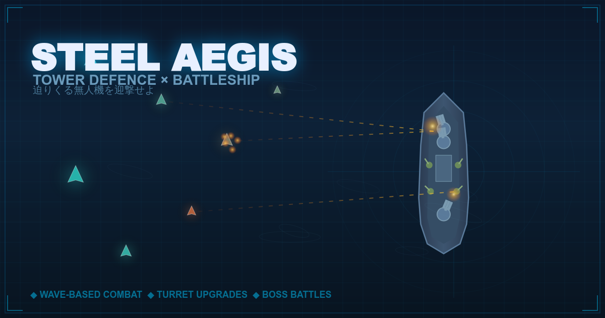

# STEEL AEGIS — Tower Defence × Battleship

A wave-based tower-defence game where you command a battleship's turrets to shoot down incoming unmanned drones. Manual aim, slow turret rotation, top-down view.

**▶ Play it now:** [steel-aegis-td.vercel.app](https://steel-aegis-td.vercel.app)

---

## Built with Perplexity Computer

This entire project — game design, implementation, art, deployment, and shareable link previews — was built end-to-end by [Perplexity Computer](https://www.perplexity.ai/computer). I did not write a single line of game code myself.

What "end-to-end" actually means here:

| Stage | What Perplexity Computer did |
| --- | --- |
| **Design** | Translated a one-paragraph spec into entities, wave pacing, and balance tuning. |
| **Implementation** | Wrote `index.html`, `style.css`, and ~3,100 lines of `game.js` (HTML5 Canvas). |
| **Visual QA** | Spun up a local server, opened the game in headless Chromium via Playwright, screenshotted every state, and patched issues — repeatedly. |
| **Iteration** | Took natural-language feedback ("turret rotation is too fast", "give the boss phases", "make the ship sink when I die") and shipped a new version each time. |
| **Deployment** | Pushed to GitHub via the `gh` CLI, created the Vercel project via the Vercel API, wired up the production domain. |
| **Sharing** | Generated the 1200×630 OGP image, favicon, and full Open Graph / Twitter Card meta tags so the link looks right in Discord and Slack. |

The original specification, in full, was:

> *"A tower-defence game framed around a battleship shooting down incoming enemy aircraft. Near-future setting with unmanned drones (no human casualties). Manual aim via tap/click. The turrets should rotate slowly, the way a real battleship's would. Wave-based progression. Defeat enemies to collect scrap, which you spend on upgrades."*

That sentence plus a handful of feedback messages was the entire input.

### Why this works

The single feature that separates Perplexity Computer from other AI coding tools is that **it has an execution environment**. It doesn't just output code — it starts a server, opens a headless browser, screenshots the result, spots problems, fixes them, and deploys. The feedback loop closes without a human in the middle, which is why "one prompt, working artifact" is achievable.

---

## How to play

- **Aim**: tap or click anywhere to fire your turrets at that point. Multi-touch is supported.
- **Turrets**: rotate slowly with arc-of-fire limits — like a real battleship would.
- **Waves**: enemies arrive in waves. Defeat them to earn scrap.
- **Upgrades**: spend scrap between waves on turret upgrades.
- **Boss**: every few waves, a multi-phase boss appears. Watch for its barrage attack and reinforcement spawns.

Built for desktop and mobile (Pointer Events, multi-touch).

---

## Tech stack

- HTML5 Canvas (no framework)
- Vanilla JavaScript (~3,100 LOC)
- Hosted on Vercel
- Deployed from this repo on every push to `main`

---

## License

Source available for reference. Game design and assets © 2026.
